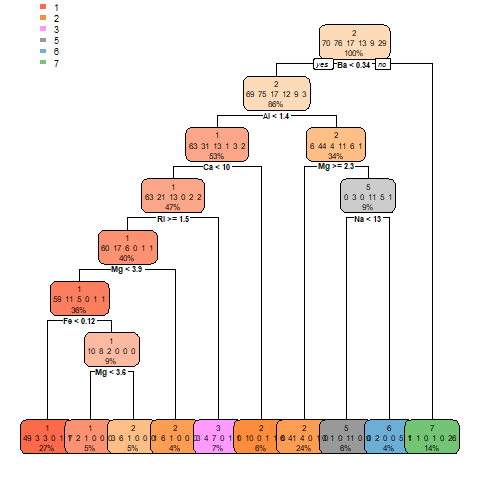

# tree_lab
tree_lab
## Work1
Before pruned:



After pruned:


## Work2
Before pruned:


The spam7 uses these features to define whether a mail is spam:
* crl.tot: total length of uninterrupted sequences of capitals
* dollar:Occurrences of the dollar sign, as percent of total number of characters
* bang: Occurrences of `!', as percent of total number of characters
* money: Occurrences of `money', as percent of total number of words
* n000: Occurrences of the string `000', as percent of total number of words
* make: Occurrences of `make', as a percent of total number of words

As what we can see in the tree, the percentage of '000' and 'make' will not define whether mail is spam and a mail with higher total length and '$' '!' 'money' will deifine as a spam.

After pruned:

k=1 and k=5:


k=10:


K = 10 is better because it has less error and is less overfitted than the original tree.

## Work3
```
Regression Tree:
MAE = 6836.34
SVM Regression:
MAE = 5870.39
```

As what we can see in the results SVM is better than Regression Tree. 

Explanation: The SVM regression model is more accurate than the regression tree because it uses a more complex algorithm to fit the data. SVM regression models can handle non-linear relationships and can automatically select features. On the other hand, regression trees use hierarchical conditions to predict the response variable, which may fail to capture non-linear relationships and may overfit. Therefore, in this example, we chose the SVM regression model as the best model.
